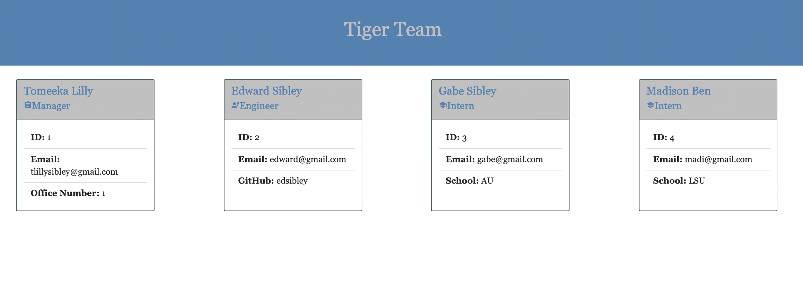

# Team-Profile-Generator

  

     
  ## Description

  Provide a short description explaining the what, why, and how of your project. 

Build a Node.js command-line application that takes in information about employees on a software engineering team, then generates an HTML webpage that displays summaries for each person. Testing is key to making code maintainable, so you’ll also write a unit test for every part of your code and ensure that it passes each test.

  ## Table of Contents 

  - [Installation](#installation)
  - [Usage](#usage)
  - [Credits](#credits)
  - [Contributions](#contributions)
  - [Tests](#tests)
  - [License](#license)
  
  ## Installation
  What commands are required to run your to install dependencies? 
  
  npm i
  
  ## Tests
  What commands are required to run tests? 

  jest
  
  ## Usage
  What does the user need to know about using this repository? Provide instructions and examples for use. 

  + 
 

  ## Credits
  List your collaborators with links to their GitHub profiles, any third-party assets that require attribution, list the creators with links to their primary web presence in this section, and if you used tutorials, include links to those here as well.

  None

  ## Contributions
  What does the user nee to know about contributing to the repository?

  No contributions at this time

  ## License

  This project is licensed under [GNU GPLv3 license](https://www.gnu.org/licenses/gpl-3.0.en.html).

   Permissions of this strong copyleft license are conditioned on making available complete source code of licensed works and modifications, which include larger works using a licensed work, under the same license. Copyright and license notices must be preserved. Contributors provide an express grant of patent rights. 

  ## Questions

  If you have any questions or concerns, contact the project creator at tlillysibley@gmail.com.
  GitHub profile page is [tlillysib](https://github.com/tlillysib).

